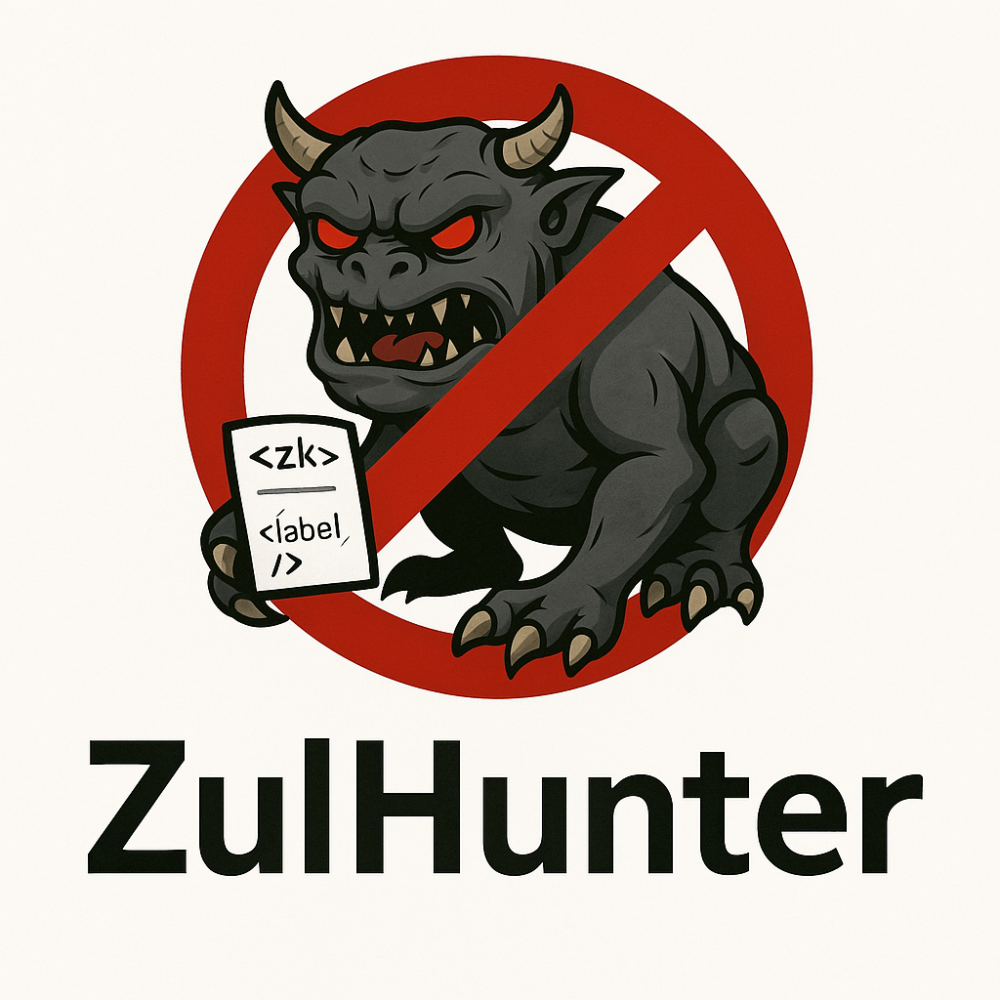

# ZulHunter



ZulHunter is a Python-based linter tool designed for advanced web developers working with the ZKoss framework. It scans your ZUL files for common security vulnerabilities—helping you catch dangerous patterns before they become real issues in your code.

## What is ZulHunter?

ZulHunter helps you keep your ZKoss applications secure by:
- **Scanning for dangerous `<zscript>` blocks:** Detects unsafe Groovy code that could lead to remote code execution.
- **Identifying unsanitized dynamic content:** Flags risky usage of user inputs, such as raw `<html>` components, dynamic includes with EL expressions, and unsafe client-side calls.
- **Highlighting backend pitfalls:** Warns about potentially unsafe Java methods and improper use of expressions that might expose sensitive data.
- **Supporting glob patterns:** Easily scan a whole directory of ZUL files with a single command.

## Features

- **Comprehensive Scanning:** Uses powerful regex patterns to detect dangerous code snippets.
- **Detailed Reporting:** Provides file names and line numbers with clear, descriptive messages for each potential vulnerability.
- **Easy to Extend:** Customize or add new checks by modifying the regex patterns.
- **Supports Multiple Files:** Run it against a glob pattern (e.g., `*.zul`) to scan many files at once.

## Installation

ZulHunter is written in Python 3 and doesn't require any external libraries beyond the Python standard library. Simply clone the repository and you're ready to go!

```bash
git clone https://github.com/yourusername/ZulHunter.git
cd ZulHunter
chmod +x ZulHunter.py
```

## Usage

Run ZulHunter by pointing it at one or more ZUL files or a glob pattern:

```bash
./ZulHunter.py *.zul
```

This command will scan all matching ZUL files in the current directory and output a report highlighting any dangerous patterns found.

### Example Output

```plaintext
Scanning files for potential security issues... (stay curious and keep coding secure!)

File: adminConsole.zul
  Line 15: [Groovy zscript block] Groovy zscript block detected. Check for dynamic evaluation and potential script injection.
  Line 21: [Dynamic GroovyShell.evaluate() call] Dynamic GroovyShell.evaluate() call detected in zscript. Potential for remote code execution.

File: feedback.zul
  Line 8: [<html> component] Raw <html> component detected. Ensure proper sanitization if rendering user-provided content.
```

## Contributing

We welcome contributions to make ZulHunter even better! If you find a bug or have ideas for new features, please open an issue or submit a pull request. Let’s work together to help developers write safer, more secure ZKoss applications.
